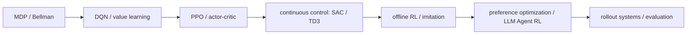

# RL Lab

一个面向实践的强化学习实验仓库：从 MDP 与 PPO 的基本机制，到 offline RL、偏好优化和 LLM
Agent RL。每个实验都应有可执行代码、固定配置、聚合指标、失败案例与明确的适用边界。

## 学习主线

## 计划中的实验

| 模块 | 第一个可复现实验 | 核心问题 |
| --- | --- | --- |
| Foundations | Tabular Q-learning on GridWorld | return 与 Bellman backup 如何工作？ |
| Value learning | DQN on CartPole / LunarLander | replay、target network、exploration 的作用是什么？ |
| Policy optimization | PPO on LunarLander / MiniGrid | GAE 与 clipping 怎样稳定更新？ |
| Continuous control | SAC / TD3 | stochastic policy 与 entropy 的收益是什么？ |
| Offline RL | Behavior Cloning → IQL / CQL | 如何避免 distribution shift？ |
| Imitation / preference | DAgger / preference reward model | 为什么监督信号和在线交互要分开？ |
| LLM Agent RL | verifiable-reward toy agent | rollout、credit assignment 和 reward hacking 如何出现？ |
| RL systems | vectorized rollout / profiling | 环境吞吐、GPU 利用率和评估如何共同约束训练？ |

## Kaggle T4×2 的使用边界

适合经典控制、Atari、小中型视觉 RL、MiniGrid、offline RL、LoRA 级别的 Agent/RL 教学实验。
不把它当作大规模 RLHF、生产策略训练或真实业务动作的平台。

## 产物规范

- `experiments/`：每个实验独立的配置、入口和说明。
- `docs/`：原理、协议、故障复盘和学习笔记。
- `reports/`：只提交自主撰写的 Markdown 报告与聚合指标。
- `assets/diagrams/`：原创 SVG 图。
- `results/`：本地或 Kaggle 临时输出，始终不提交。

不提交原始公开数据集、模型权重、token、逐样本轨迹、含个人信息材料或外部协作文档导出物。

## 第一阶段

从 [学习协议](docs/learning-protocol.md) 开始。第一项实验将实现并对比
Q-learning、DQN 与 PPO 的最小闭环，再在同一任务上测量 sample efficiency、稳定性与吞吐。

完整的算法原理、数学公式和能力关系见 [RL 学习地图](docs/rl-learning-map.md)；
逐项可执行门槛见 [实验 Todo](docs/experiment-todo.md)。

论文阅读顺序见 [参考资料](docs/references.md)，外部公开科研数据的准入规则见
[数据政策](docs/public-research-data-policy.md)。第一轮已完成的
[A1 GridWorld 报告](reports/a1-gridworld-value-learning.md) 是后续 DQN/PPO 实验的可验算基线。
