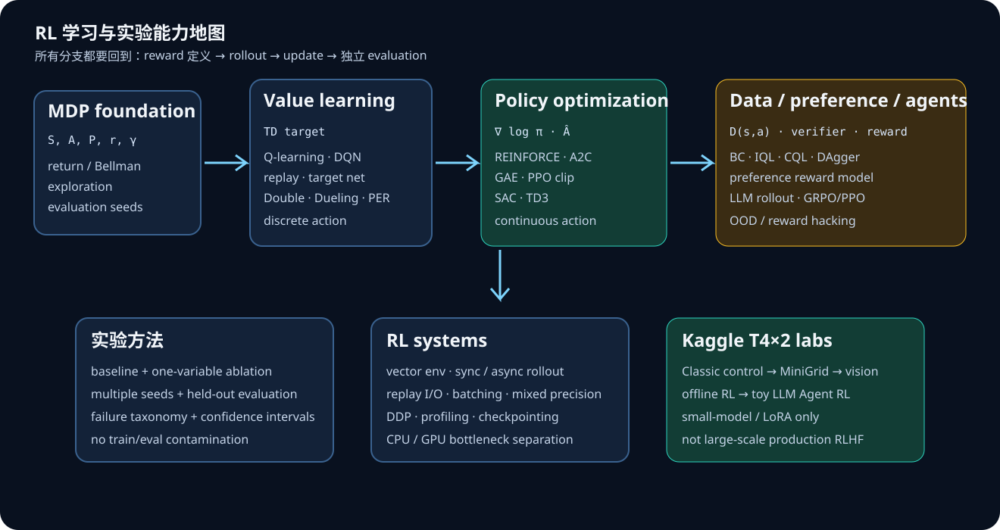

# 强化学习学习地图：原理、算法与实验

这张地图的目标不是“背算法名”，而是把每一类算法放回同一条闭环：

```text
environment → rollout → return / advantage → update policy or value → evaluation
                    ↑                                      ↓
              reward design                         exploration / constraints
```



## 0. 统一语言：MDP 与评估

一个折扣 MDP 为 `(\mathcal M=\langle\mathcal S,\mathcal A,P,r,\gamma\rangle)`。策略
`\pi_\theta(a\mid s)` 产生轨迹，优化目标是：

$$
J(\theta)=\mathbb E_{\tau\sim\pi_\theta}\left[\sum_{t=0}^{T-1}\gamma^t r_t\right],
\qquad
G_t=\sum_{k=0}^{T-t-1}\gamma^k r_{t+k}.
$$

每项实验都必须分开报告训练 return、独立 evaluation return、success rate、样本数、wall time、
方差和 seed。训练曲线不是泛化证据。

## 1. Value learning：先理解“估计未来”

### Tabular Q-learning

Bellman optimality backup：

$$
Q(s_t,a_t)\leftarrow Q(s_t,a_t)+\alpha
\left[r_t+\gamma\max_a Q(s_{t+1},a)-Q(s_t,a_t)\right].
$$

要理解：bootstrapping、off-policy、`\epsilon`-greedy、奖励稀疏和状态访问覆盖。

### DQN 家族

神经网络近似 `Q_\phi`，最小化 temporal-difference loss：

$$
\mathcal L(\phi)=\mathbb E_{(s,a,r,s')\sim\mathcal D}
\left[\left(r+\gamma\max_{a'}Q_{\bar\phi}(s',a')-Q_\phi(s,a)\right)^2\right].
$$

关键模块：replay buffer 打破样本相关性；target network 降低 moving-target 不稳定；
Double DQN 减少 max overestimation；dueling 分开 value 与 advantage；PER 调整采样权重。

## 2. Policy gradient 与 Actor-Critic：直接优化动作分布

REINFORCE：

$$
\nabla_\theta J(\theta)=
\mathbb E\left[\sum_t \nabla_\theta\log\pi_\theta(a_t\mid s_t)G_t\right].
$$

用 baseline `V_\psi(s)` 得到 advantage `A_t=G_t-V_\psi(s_t)`，降低方差而不改变期望梯度。
GAE 在偏差和方差之间折中：

$$
\hat A_t^{\mathrm{GAE}(\gamma,\lambda)}
=\sum_{l=0}^{\infty}(\gamma\lambda)^l\delta_{t+l},
\quad
\delta_t=r_t+\gamma V(s_{t+1})-V(s_t).
$$

### PPO

令 `r_t(\theta)=\pi_\theta(a_t|s_t)/\pi_{\theta_{old}}(a_t|s_t)`：

$$
L^{CLIP}=\mathbb E_t\left[
\min\left(r_t\hat A_t,
\operatorname{clip}(r_t,1-\epsilon,1+\epsilon)\hat A_t\right)
\right].
$$

实验要观察：clip fraction、KL、entropy、value loss、explained variance、policy collapse。PPO 是
on-policy：样本新鲜但昂贵，rollout 吞吐往往比 GPU 计算更早成为瓶颈。

## 3. 连续控制：SAC / TD3

TD3 用双 critic、target-policy smoothing、延迟 actor update 抑制 Q 的高估。SAC 则最大化
回报与熵：

$$
J(\pi)=\mathbb E\left[\sum_t r_t+\alpha\mathcal H(\pi(\cdot|s_t))\right].
$$

这里要理解 reparameterization、temperature `\alpha`、critic target 和 off-policy data reuse。

## 4. Offline RL、模仿与偏好

offline RL 只能从固定数据 `\mathcal D` 学习。难点是 policy 会选择数据分布外的动作，
critic 因而错误外推。Behavior Cloning 的目标是：

$$
\max_\theta\;\mathbb E_{(s,a)\sim\mathcal D}[\log\pi_\theta(a|s)].
$$

CQL 用保守 Q 降低 OOD 动作价值；IQL 用 expectile regression 避免显式最大化 OOD 动作。
模仿学习需要区分 BC 的 covariate shift 与 DAgger 的在线数据聚合。

偏好学习先拟合 reward model，例如 Bradley--Terry：

$$
P(\tau^+\succ\tau^-)=\sigma(R_\varphi(\tau^+)-R_\varphi(\tau^-)).
$$

必须单独测量 reward-model accuracy 与真实任务 success，防止 reward hacking。

## 5. LLM / Agent RL

LLM RL 的核心仍是 rollout、reward、advantage 和 constrained update。最适合起步的是可验证奖励：
代码单测、数学答案、受限工具环境或 MiniGrid 任务。不要把“模型自评”当奖励真值。

最小链路：SFT policy → 固定 verifier/reward → batch rollouts → group / token advantage → policy update →
held-out verifier evaluation。重点学习 credit assignment、长度偏差、KL 约束、reward hacking、
train/eval contamination 与 rollout throughput。

## 6. 系统能力

需要掌握：vectorized environments、sync/async rollout、replay I/O、mixed precision、DDP、
checkpoint、确定性、evaluation isolation、profiling。Kaggle T4×2 的正确用法是小模型或视觉 policy
的训练/推理、多环境批量推理与吞吐测量；复杂仿真通常会先受 4 CPU 核限制。
