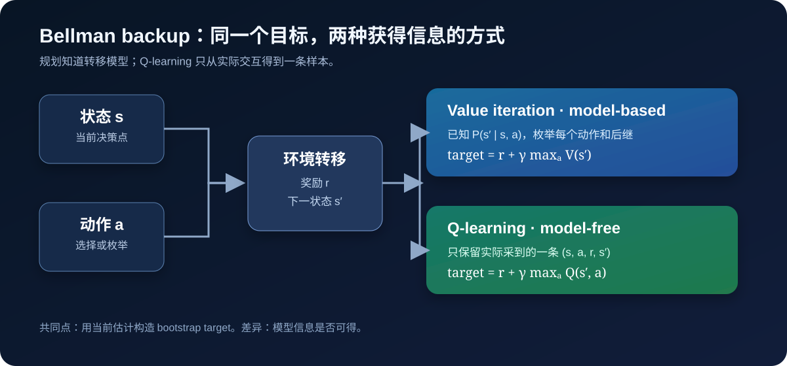
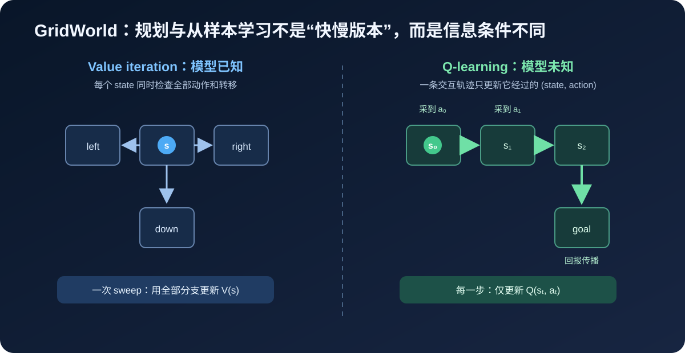
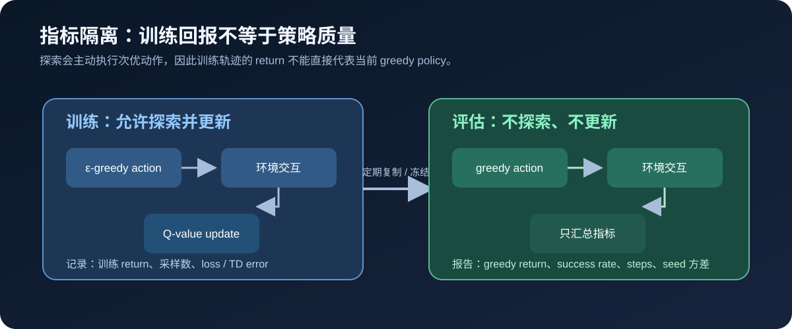

# A1：GridWorld 中的 Value Iteration 与 Q-learning

## 要回答的问题

已知环境模型时，动态规划怎样规划；不知道转移函数时，Q-learning 怎样只从交互样本恢复同一决策？

## 先理解的数学

Bellman optimality equation：

$$
V^{\star}(s)=\max_{a}\sum_{s^{\prime}}P(s^{\prime}\mid s,a)
\left[r(s,a,s^{\prime})+\gamma V^{\star}(s^{\prime})\right].
$$

本实验环境是确定性的，故每个 `(s,a)` 只有一个后继。Q-learning 的 sample backup：

$$
Q(s_t,a_t)\leftarrow Q(s_t,a_t)+\alpha
\left[r_t+\gamma\max_{a}Q(s_{t+1},a)-Q(s_t,a_t)\right].
$$

$\max_{a}Q$ 使它是 off-policy：行为策略可以是 $\epsilon$-greedy，但学习目标仍是 greedy policy。



上图将两种算法对齐在同一个 bootstrap target 上：value iteration 的输入是完整模型，Q-learning 的输入是一条经验。
它们不是谁“更先进”的关系，而是面对不同信息条件的解法。



对于一个状态，规划一次能检查所有可行动作；Q-learning 必须通过反复采样，才逐步让价值信息沿真实轨迹向前传播。



训练时的 $\epsilon$-greedy return 会被有意加入的随机探索拉低；因此最终报告只使用冻结后的 greedy policy。

## 运行

```bash
python3 experiments/a1_gridworld/q_learning_vs_value_iteration.py
```

输出写入被忽略的 `results/a1_gridworld/`。仅将聚合 metrics 和自建 Markdown 报告带回仓库。

## 要检查的现象

1. Value iteration 的起点价值是规划参考，不需要探索。
2. Q-learning 初期因探索回报差，随后评估路径应收敛至 goal。
3. 若 $\epsilon$ 降得太快，会发生未充分探索；若 $\alpha$ 太大，值会震荡。
4. 训练 episode return 不能替代 greedy evaluation：训练中包含故意随机动作。
