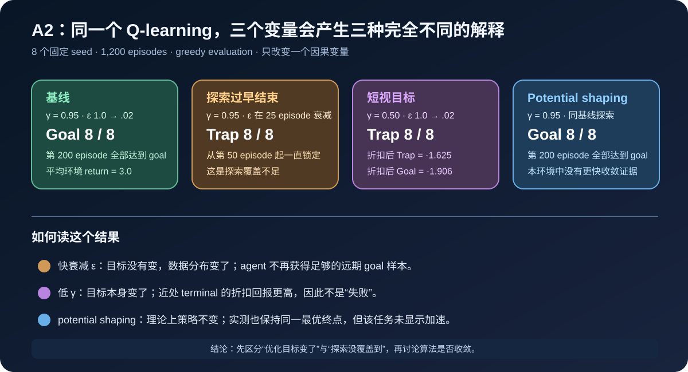

# A2：折扣、探索与奖励塑形的受控实验

## 结论

在同一个 deterministic 5×5 GridWorld 中，四个条件各运行 8 个固定 seed、1,200 个 episode。
基线和 potential-based shaping 都在第 200 个 episode 前让 8/8 个 seed 到达远处 goal；探索在
25 个 episode 内衰减完会让 8/8 个 seed 锁定近处 trap；将 $gamma$ 从 $0.95$ 降到 $0.50$ 也让
8/8 个 seed 选择 trap，但这是折扣目标改变后的正确行为，不是收敛失败。

## 环境与变量

起点为 $(0,0)$，远处 goal 在 $(4,4)$，到达奖励为 $10$；近处 trap 在 $(0,4)$，到达奖励为 $1$；
非终止步奖励均为 $-1$。评估使用无探索的 greedy policy，且始终按原始环境奖励计分。

| 条件 | 只改变的变量 | 最终 goal / trap | 首次 8/8 goal checkpoint |
| --- | --- | --- | --- |
| baseline | $gamma=0.95$，$epsilon$ 1.0→0.02（1,000 episode） | 8 / 0 | 200 |
| fast epsilon decay | $epsilon$ 在 25 episode 衰减至 0.02 | 0 / 8 | 无 |
| low gamma | $gamma=0.50$ | 0 / 8 | 无 |
| potential shaping | $r^{\prime}=r+\gamma\Phi(s^{\prime})-\Phi(s)$ | 8 / 0 | 200 |

## 为什么低 $gamma$ 不是“失败”

远处 goal 的折扣回报与近处 trap 的折扣回报分别为：

$$
G_{\mathrm{goal}}=-\sum_{t=0}^{6}\gamma^t+10\gamma^7,
\qquad
G_{\mathrm{trap}}=-\sum_{t=0}^{2}\gamma^t+\gamma^3.
$$

当 $gamma=0.95$ 时，$G_{\mathrm{goal}}\approx0.950$，$G_{\mathrm{trap}}\approx-1.995$，应选 goal。
当 $gamma=0.50$ 时，$G_{\mathrm{goal}}\approx-1.906$，$G_{\mathrm{trap}}=-1.625$，应选 trap。
因此，低折扣的结果验证了 Bellman objective 的变化；不能把“没有到达远处目标”一概称为训练不稳定。

## 探索与塑形的边界

快衰减 $epsilon$ 的条件保持 $gamma=0.95$ 不变，却从第 50 个 episode 起稳定选择 trap。原因不是
trap 在长期目标下更优，而是行为策略过早停止采到通向 goal 的回报链，TD backup 没有足够证据把远期
奖励传播回起点。

本实验的 potential $Phi$ 在两个终点均设为零，其 shaping 累积项望远镜求和后只保留与起点有关的
常数，故不应改变最优策略。实测最终目标与基线一致；但二者首次达到全 seed 成功的 checkpoint 都是
200，所以不能从这个小任务声称 shaping 提升了样本效率。下一步会在更稀疏、随机的环境中再次检验。

## 可复现性与边界

- 脚本：[A2 控制实验](../experiments/a2_gridworld_controls/q_learning_control_study.py)
- 聚合指标：[A2 metrics](a2_gridworld_controls_metrics.json)
- 不提交原始逐 episode 轨迹；本报告只引用聚合后的固定 seed 指标。
- 这是 tabular、确定性 toy environment 的因果验证，不能外推为 DQN、PPO 或生产 agent 的性能结论。
